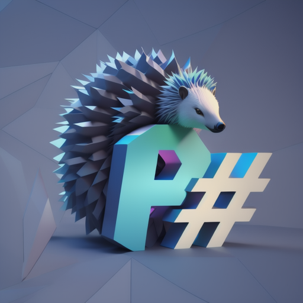

# P# Programming Language



P# is a cutting-edge programming language designed for developers who want the best of both worlds: the simplicity and expressiveness of Python, combined with the power and performance of C#. With a focus on static typing, efficient memory management, and seamless integration with C libraries, P# opens up new possibilities for building high-performance applications and scripting tasks.

## Table of Contents

- [Introduction](#introduction)
- [Key Features](#key-features)
- [Important Note](#important-note)
- [Quick Start](#quick-start)
- [Language Syntax](#language-syntax)
- [Memory Management](#memory-management)
- [Custom Classes](#custom-classes)
- [Integration with C Libraries](#integration-with-c-libraries)
- [Scripting Capabilities](#scripting-capabilities)
- [Contributing](#contributing)
- [License](#license)

## Introduction

P# is the brainchild of a software developer who understand the nuances of both Python and C#. It combines the readability and ease of use of Python with C#'s performance and type system. This unique blend allows developers to write code that is both elegant and efficient, whether they're working on complex applications or quick scripting tasks.

## Key Features

### Static Typing

P# enforces static typing to catch errors at compile-time, providing increased reliability and improved performance. This ensures that type-related issues are caught early in the development process and ensured a smaller memory footprint and faster code.

### Hybrid Memory Management

P# utilizes a hybrid memory management system to optimize memory usage. It employs static memory management whenever possible, while resorting to a garbage collector for other objects. This approach strikes a balance between performance and memory efficiency.

### Seamless C Library Integration

**NOTE:** *Not yet implemented*

Developers can harness the power of existing C libraries by seamlessly linking them with P# code. This allows you to leverage a vast array of libraries for various purposes, enhancing the language's capabilities and reducing development time.

### Scripting Simplicity

P# stands out as a scripting-friendly language by eliminating the need for a main class or function. This makes it perfect for quick scripts, automation tasks, and prototyping, reducing boilerplate code and streamlining the development process.

## IMPORTANT NOTE

At the moment the compiler is currently only functional until the Typing tree (`-C T` flag). Development is underway to convert the typing tree to a control graph then translating it to LLVM-IR where it will be compiled down to machine code using clang.

## Quick Start

To start using P#, follow these simple steps:

1. **Installation**: Download and install the P# compiler from the github page [github.com/TheD0ubleT/P-Sharp-Lang](https://github.com/TheD0ubleT/P-Sharp-Lang).

2. **Hello, World!**: Write your first P# program by printing "Hello, World!" to the console:

   ```csharp
   print("Hello, World!");
   ```

### Compile and Run: Use the P# compiler to compile your program

```sh
python ./compiler/main.py -o output_executable your_program_source.psc
```

### Run code

```sh
./output_executable
```

## Language Syntax

P#'s syntax draws inspiration from C# to provide a familiar environment for developers. Here's a quick example of variable declaration, function definition and function call:

```rust
// Variable declaration
int32 x = 42;

// Function definition
int32 min(int32 a, int32 b) {
    return a < b ? a : b;
}

//function call
print(min(x, 1337));
```

## Memory Management

P# employs a hybrid memory management system to optimize ease of use and performance. It employs static memory management for efficiency when possible and uses a garbage collector for all other objects which don't have easy deterministic lifespan to prevent memory leaks and ensure robustness.

## Custom Classes

Create your own custom classes in P# to encapsulate data and behavior:

```csharp
class Point {
    float32 x;
    float32 y;

    Point(float32 x, float32 y) {
        this.x = x;
        this.y = y;
    }

    float32 squareNorm(){
        return x * x + y * y;
    }
}
```

## Integration with C Libraries

P# will enable easy integration with C libraries to enhance functionality while keeping everything safe of memory leaks. Declare external functions using the `extern` keyword:

```c
extern int32 rand(void);
extern int16 atos(char[] s);
```

## Scripting Capabilities

Thanks to its lightweight nature and absence of main class/function requirements, P# excels as a scripting language. Perform quick tasks without unnecessary setup or classes.

## Contributing

We welcome contributions to P# from the community. Feel free to submit issues, feature requests, and pull requests on our GitHub repository.

## License

P# is released under the MIT License, making it open and accessible for both personal and commercial projects.

Get started with P# today and experience the power of a language that marries the elegance of Python with the efficiency of C#.

Happy coding!
